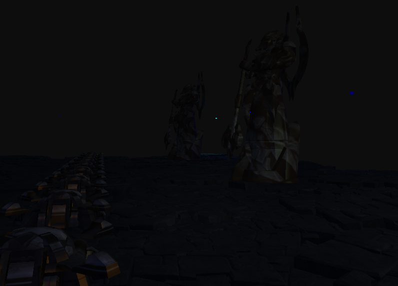
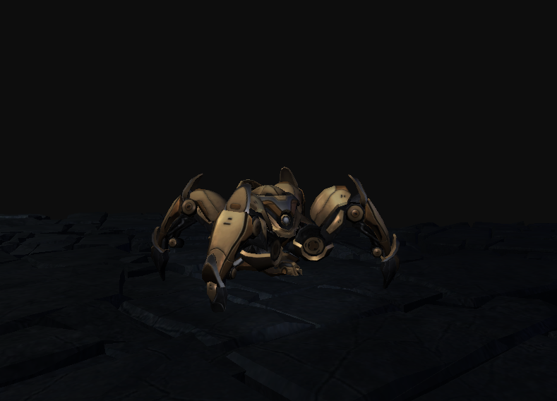

# Proyecto de Escena 3D con Learning OpenGL

Este proyecto es una implementación práctica en **C++ y OpenGL** inspirada en motores de videojuegos modernos.  
La escena combina diferentes técnicas avanzadas de renderizado y animación, integrando un entorno interactivo en tercera persona.

LINK: https://drive.google.com/drive/folders/1nSqXW7A_XEWb7iyGt-jln356bp04bOSu?usp=sharing

## ✨ Características principales

- **Múltiples luces dinámicas**: soporta direccionales, puntuales y focos, con cálculo de atenuación y sombreado en tiempo real.  
- **Animación esquelética**: integración de modelos animados mediante *skeletal animation* utilizando huesos y keyframes.  
- **Vista en tercera persona**: cámara orbital que sigue al personaje con rotación libre.  
- **Control de personaje**: desplazamiento mediante teclas **WASD**, con soporte de animaciones de movimiento y de reposo.  
- **Modelos 3D de estrategia**: se emplearon modelos de unidades extraídos de un editor oficial para juegos de estrategia en tiempo real.

## 🕹️ Controles

- **W / A / S / D** → Movimiento del personaje  
- **Mouse** → Rotación de cámara  

## 📂 Recursos de modelos

Los modelos usados en este proyecto pueden obtenerse directamente desde la **plataforma oficial de Battle.net** a través del **Editor del juego**:  

1. Descarga el **Editor** desde el *launcher* de Battle.net.  
2. Abre el editor y navega a la sección de **Assets / Importar modelos**.  
3. Exporta los archivos en formato `.m3` o conviértelos a `.fbx` / `.dae` para integrarlos en el proyecto.  

> ⚠️ Nota: Los modelos son propiedad de Blizzard Entertainment. Este proyecto se ha desarrollado con fines académicos y de aprendizaje, sin fines de lucro.

